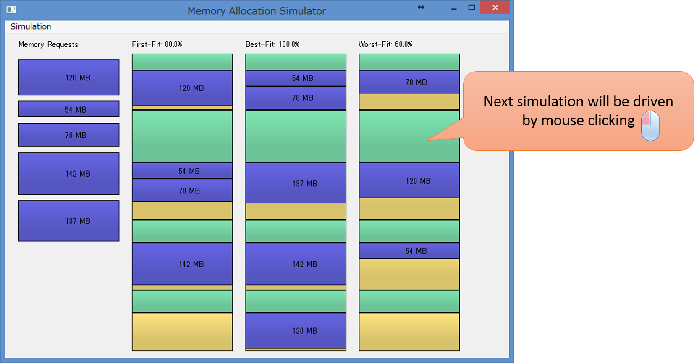
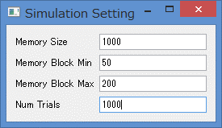

Simple Memory Allocation Simulator. (Python)
====

This package is a toy program used for **"Operating System"** lecture.
It simulates common memory allocation strategies: **First-Fit**, **Best-Fit**, and **Worst-Fit**.

* **First-Fit**:
    - The allocator places process data where the **first** large free available block is found.
* **Best-Fit**:
    - The allocator places process data in the **smallest** free available block.
* **Worst-Fit**:
    - This memory allocation strategy is opposite to **Best-Fit**. It places process data in the **largest** free available block.

Before processing a each simulation, the memory status is randomly initialized with several *"used"* blocks and *"free"* available blocks.
Memory requests are also randomly initialized with their total size as 80% of the total *"free"* available space.
In the simulation, **First-Fit**, **Best-Fit**, and **Worst-Fit** try to fit the requested memory blocks with their own strategies.
For each memory allocation strategy, its success rate is computed as *success count/ request count*.

## GUI
### Main Window
Next simulation will be driven by each mouse clicking.
In this example, requested memory blocks are `120MB`, `54MB`, `78MB`, `142MB`, `137MB`.
**First-Fit** fails to fit `137MB`, **Worst-Fit** fails to fit `137MB` and `142MB`.
**Best-Fit** can fit all of memory requests.



### Setting GUI

You can change simulation setting via `Simulation -> Setting GUI`.

* **Memory Size**: total size of the memory.
* **Memory Block Min**: minimum size of random memory blocks.
* **Memory Block Max**: maximum size of random memory blocks.
* **Num Trials**: number of simulation trials.

**Memory Block Min/Max** will change initial placements of *"used"* blocks and *"free"* available blocks within the range of the specified size.
**Num Trials** is used for observing the success rates with different number of trials.



## Results

By changing **Num Trials** setting, I observed the success rate of each memory allocation strategy with several number of trials.
Regardless of the number of trials, the order of the success rates was **Best-Fit** > **First-Fit** > **Worst-Fit**.
In my simulation, even **Best-Fit** (best performance for success rate) can fail to fit the requested memory blocks
since I do not check if the requested memory blocks can be fitted or not.
But we can see the overall performance tendency between them.

|Number of Trials  |**First-Fit** | **Best-Fit**  | **Worst-Fit** |
|--------------|---------------|-----------------|-----------------|
|50            | 76.01%       | <span style="color:red">80.85%</span>     | <span style="color:blue">67.94%</span> |
|500            | 74.81%       | <span style="color:red">79.16%</span>     | <span style="color:blue">69.34%</span> |
|1000            | 74.67%       | <span style="color:red">79.08%</span>     | <span style="color:blue">68.52%</span> |
|5000            | 74.67%       | <span style="color:red">79.34%</span>     | <span style="color:blue">68.48%</span> |


## Installation

*Note*: This program was only tested on **Windows** with **Python2.7**.
**Linux** and **Mac OS** are not officially supported,
but the following instructions might be helpful for installing on those environments.

### Dependencies
Please install the following required python modules.

* **NumPy**
* **matplotlib**
* **PyQt**

As these modules are dependent on NumPy modules, please install appropriate packages for your development environment (Python versions, 32-bit or 64-bit).
For 64-bit Windows, you can download the binaries from [**Unofficial Windows Binaries for Python Extension Packages**](http://www.lfd.uci.edu/~gohlke/pythonlibs/).

## Usage

This package only includes a single python file `memory_allocaiton.py`.
If you can successfully install the required python modules above,
you can launch main window by executing the following command
(double clicking `memory_allocaiton.py` can be used on **Windows**).

``` bash
  > python memory_allocaiton.py
```

## License

The MIT License 2015 (c) tody