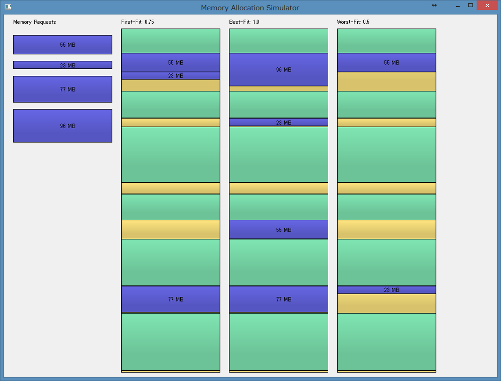
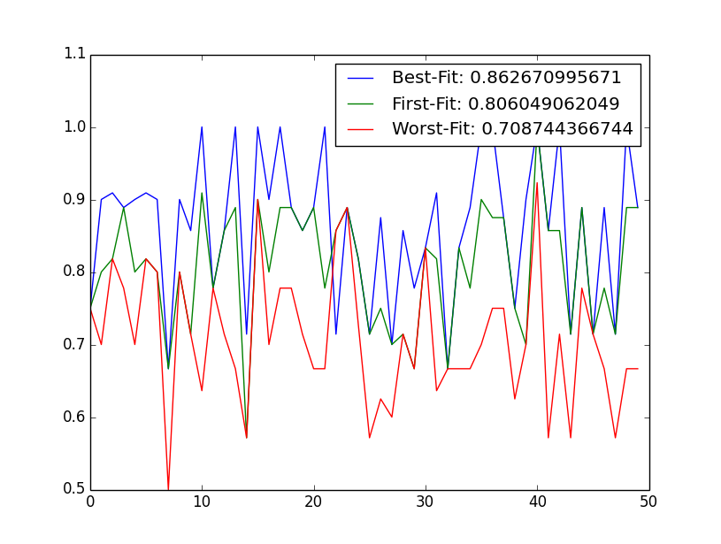
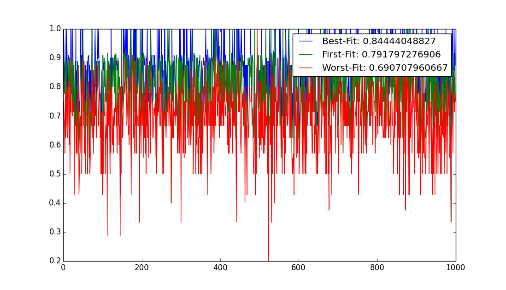

Simple Memory Allocation Simulator. (Python)
====

This package is a toy program used for **"Operating System"** lecture.
It simulates common memory allocation strategies: **First-Fit**, **Best-Fit**, and **Worst-Fit**.

* **First-Fit**:
    - The allocator places process data where the first large free available block is found.
* **Best-Fit**:
    - The allocator places process data in the smallest free available block.
* **Worst-Fit**:
    - This memory allocation strategy is opposite to **Best-Fit**. It places process data in the largest free available block.

Before processing a each simulation, the memory status is randomly initialized with several *"used"* blocks and *"free"* available blocks.
Memory requests are also randomly initialized with their total size as 80% of the total *"free"* available space.
In the simulation, **First-Fit**, **Best-Fit**, and **Worst-Fit** try to fit the requested memory blocks with their own strategies.
For each memory allocation strategy, its success rate is computed as *success count/ request count*.

### GUI
Mouse Click will simulate a memory allocation process with a new memory status.
In this example, **First-Fit** fails to fit `96MB`, **Worst-Fit** fails to fit `77MB` and `96MB`.
**Best-Fit** can fit all of memory requests.

### Results

I observed the success rate of each memory allocation strategy with several number of trials.
Overall, the result tends to be **Best-Fit** > **First-Fit** > **Worst-Fit** regardless of the number of trials.

#### 50 trials for comparison of success rates

#### 1000 trials for comparison of success rates

#### Dependencies
Please install the following required python modules.

* **NumPy**
* **matplotlib**
* **PyQt**

As these modules are dependent on NumPy modules, please install appropriate packages for your development environment (Python versions, 32-bit or 64-bit).
For 64-bit Windows, you can download the binaries from [**Unofficial Windows Binaries for Python Extension Packages**](http://www.lfd.uci.edu/~gohlke/pythonlibs/).

## License

The MIT License 2015 (c) tody